# StudentBook

StudentBook is an educational social platform for students, faculty, alumni, staff, and recruiters. It combines campus-style social networking with posts, comments, profiles, announcements, articles, job posts, resource discovery, dark mode, image uploads, and a separate video portal prototype.

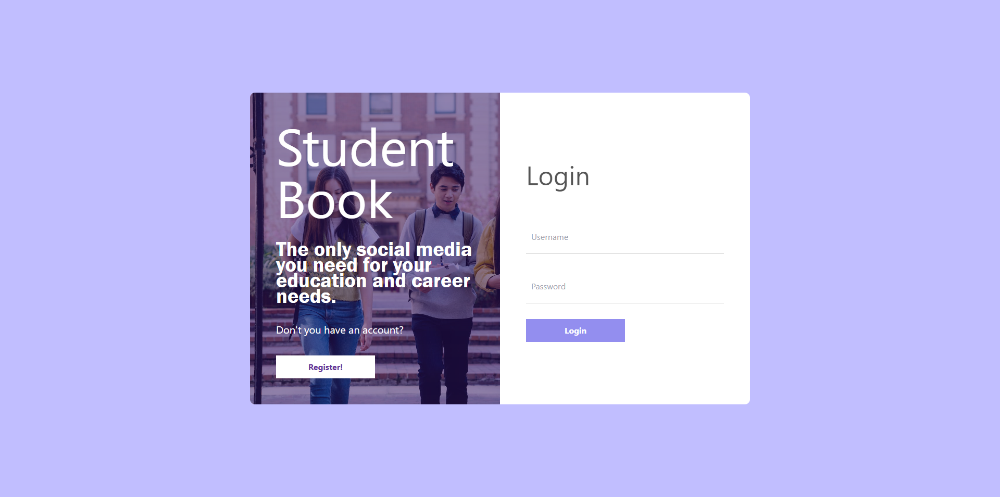

## Features

- Role-aware student, faculty, and staff accounts backed by MySQL.
- Login and registration with hashed passwords and cookie-based authentication.
- Social feed with posts, likes, comments, image uploads, and profile pages.
- Search for users and student CGPA metadata.
- Announcement, article, and job boards.
- Profile editing with cover and profile image uploads.
- Dark mode support.
- Video portal prototype in `client/VideoPortal`.

## Tech Stack

| Area | Technology |
| --- | --- |
| Main frontend | React 19, Vite 8, React Router 7, React Query 5 |
| UI and styling | SCSS, Tailwind CSS 4, MUI 9, Heroicons, React Toastify |
| API | Node.js, Express 5, MySQL2, Multer, JSON Web Token, bcrypt |
| Database | MySQL |
| Video portal | React 19, Vite 8, styled-components, MUI |
| Tooling | ESLint 10, npm lockfiles, GitHub Actions |

## Repository Layout

```text
StudentBook/
  api/                 Express API and MySQL access
  client/              Main Vite React application
  client/VideoPortal/  Separate Vite React video portal prototype
  schema/              MySQL schema export
  img/                 README screenshots and diagrams
  .github/workflows/   Release automation
```

## Requirements

- Node.js 22 or newer. The upgraded Vite and ESLint toolchain expects a modern Node runtime.
- npm 11 or newer.
- MySQL 8 or compatible.

## Setup

Clone the repository:

```powershell
git clone https://github.com/FahimFBA/StudentBook.git
cd StudentBook
```

Install API dependencies:

```powershell
cd api
npm ci
```

Create the API environment file:

```powershell
Copy-Item .env.example .env
```

Edit `api/.env` with your local MySQL credentials:

```env
DB_HOST=localhost
DB_USER=root
DB_PASSWORD=your_mysql_password
DB_NAME=studentbookdb
DB_CONNECTION_LIMIT=10
```

Import the database schema from [schema/studentbookdb.sql](schema/studentbookdb.sql). If you want to use the sample password from older setup notes, run this in MySQL as an admin user:

```sql
ALTER USER 'root'@'localhost' IDENTIFIED WITH mysql_native_password BY '1234';
FLUSH PRIVILEGES;
```

Install the main frontend:

```powershell
cd ..\client
npm ci
```

Install the video portal when you need it:

```powershell
cd VideoPortal
npm ci
```

## Running Locally

Start the API:

```powershell
cd api
npm start
```

The API runs on `http://localhost:8800`.

Start the main frontend in another terminal:

```powershell
cd client
npm run dev
```

Open `http://localhost:5173/login`.

Start the video portal prototype in another terminal when needed:

```powershell
cd client\VideoPortal
npm run dev
```

## Useful Commands

| Location | Command | Purpose |
| --- | --- | --- |
| `api` | `npm start` | Start the Express API with Nodemon |
| `api` | `npm audit` | Check API dependency advisories |
| `client` | `npm run dev` | Start the main frontend |
| `client` | `npm run build` | Build the main frontend |
| `client` | `npm run lint` | Run ESLint |
| `client` | `npm audit` | Check main frontend dependency advisories |
| `client/VideoPortal` | `npm run dev` | Start the video portal |
| `client/VideoPortal` | `npm run build` | Build the video portal |
| `client/VideoPortal` | `npm audit` | Check video portal dependency advisories |

## Test Accounts

These accounts are available when the sample database has been imported:

| Type | Username | Password |
| --- | --- | --- |
| Student | `Jane` | `1212` |
| Student | `R2` | `1212` |
| Student | `Mou` | `1212` |
| Faculty | `Israt` | `1212` |
| Staff | `Anisul` | `1212` |

## Release Process

Releases are driven by [CHANGELOG.md](CHANGELOG.md).

1. Add a new version section at the top of `CHANGELOG.md`.
2. Use this heading format:

```md
## [2.1.0] - 2026-06-12
```

3. Commit and push the changelog change to `main` or `master`.
4. The `Release from changelog` workflow creates tag `v2.1.0` and publishes a GitHub Release using that changelog section as the release notes.

If the release already exists, the workflow exits without changing it.

## Screenshots

### Login


### Register

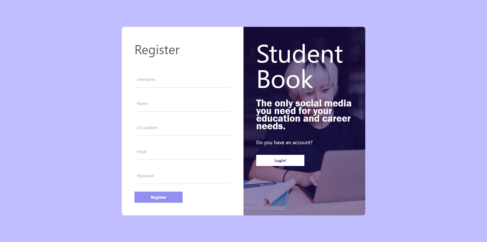

### Home


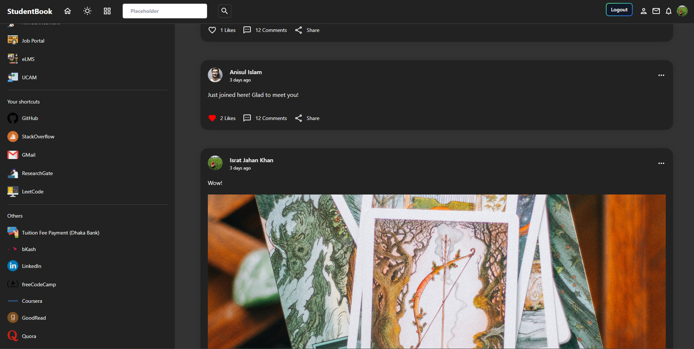

### Profile

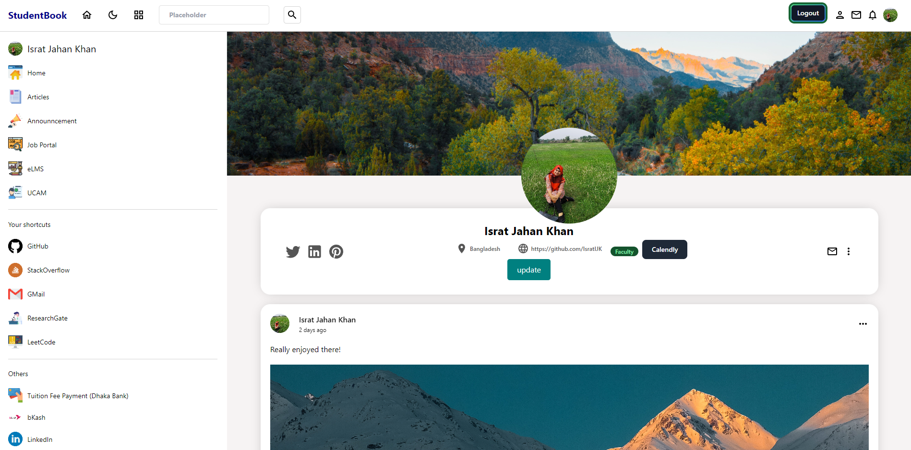
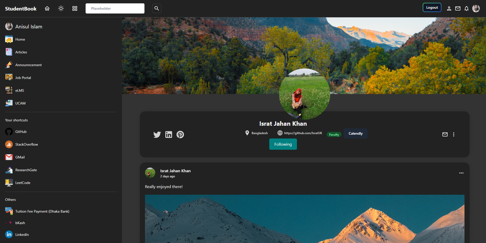

### Articles


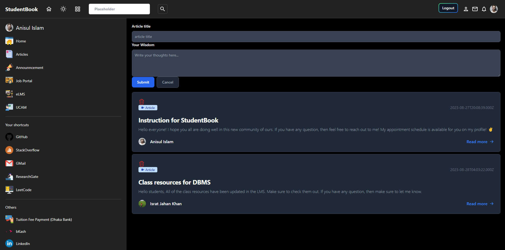

### Announcements

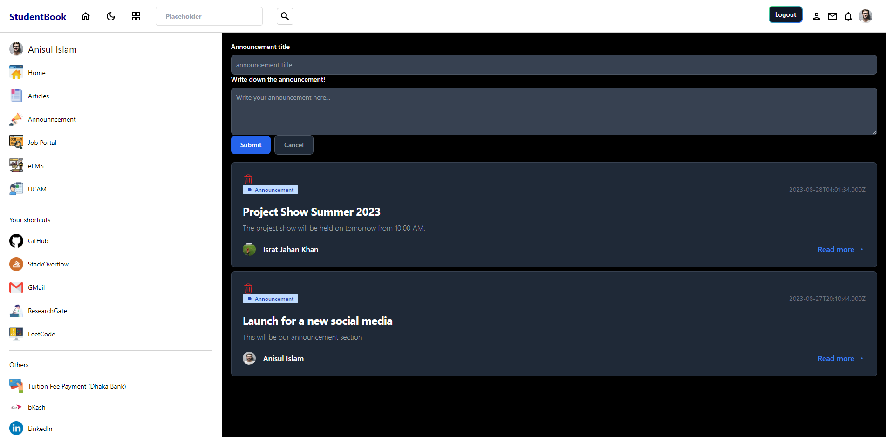
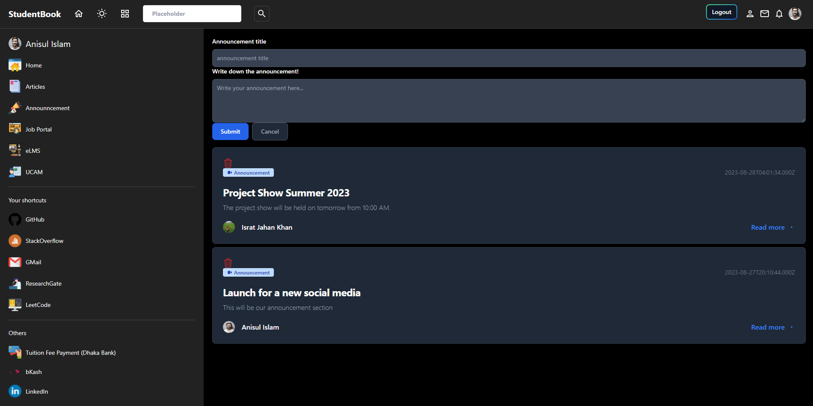

### Jobs

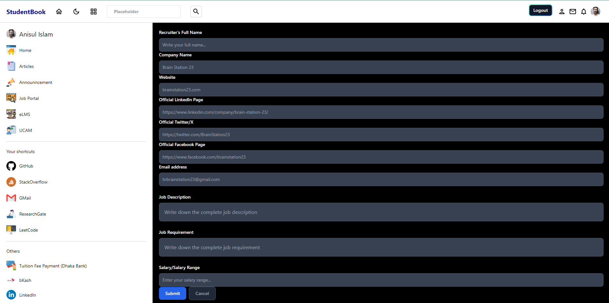
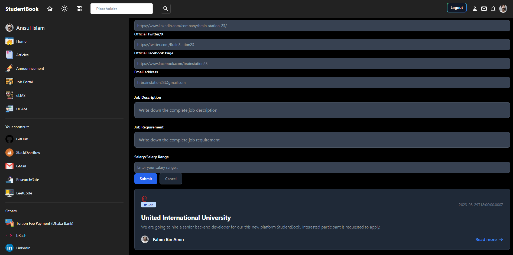

## Database Diagrams

### ERD

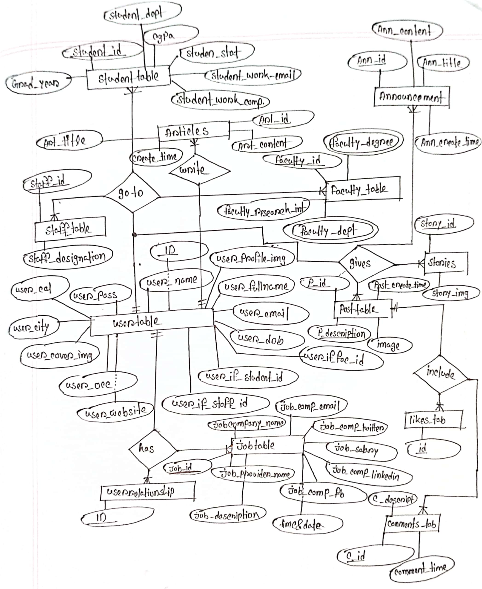

### Schema

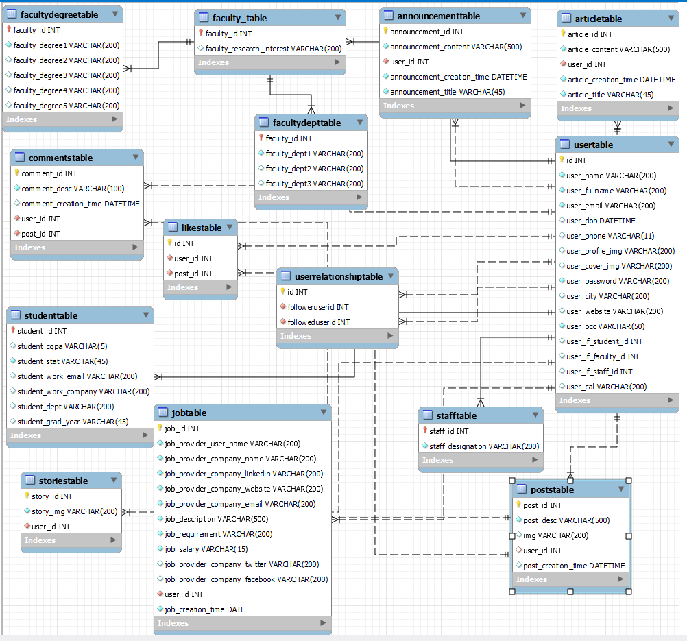

## Team

- Md. Fahim Bin Amin, Team Leader
- Israt Jahan Khan, Database Designer
- Sadia Afrin Mou, Database Designer and Poster Designer
- Abtahi Arifeen, Extra Supportive Member

## License

This project is licensed under the MIT License. See [LICENSE](LICENSE).
