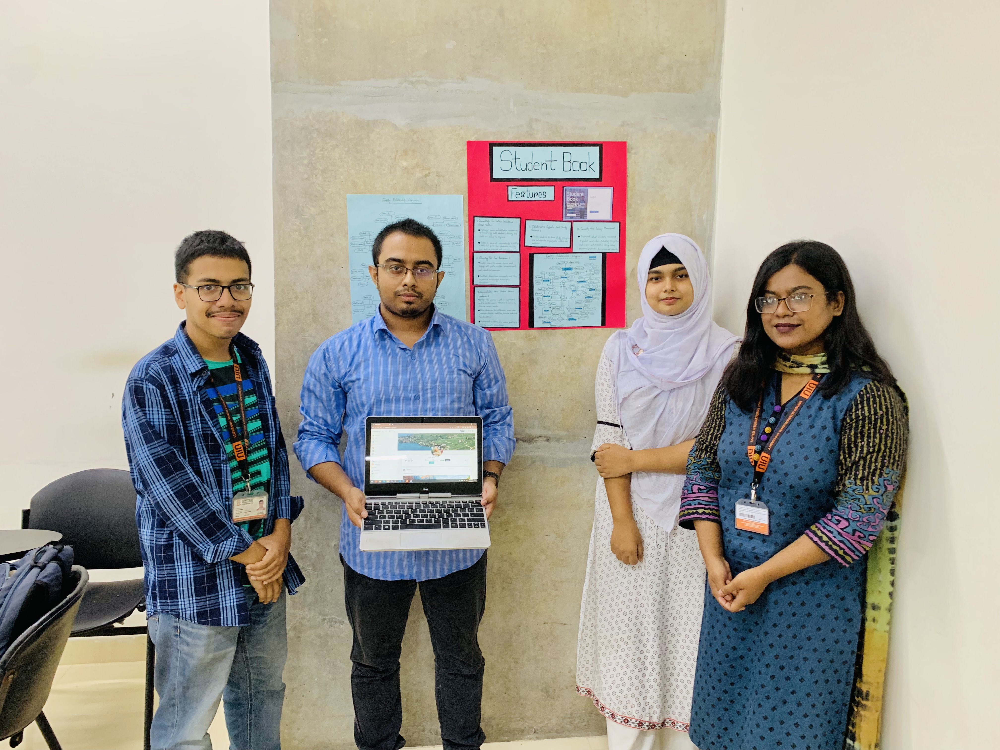

# StudentBook

The only social media you need for your education and career needs.


## :raising_hand: What is StudentBook
StudentBook is a revamped social media platform for educational institutions. It is a web application that allows students, faculty, alumni, and staff to connect and collaborate in a secure and exclusive environment. StudentBook is a one-stop solution for all your educational and career needs. It is a platform where you can share your thoughts, ideas, and resources with your peers. You can also host virtual classrooms, seminars, and workshops using the integrated video conferencing tools (using [Calendly](https://calendly.com/) for now). StudentBook also has a job portal where you can explore internship, part-time job, and full-time job opportunities. Employers can post job listings and connect with potential candidates directly through the platform. StudentBook is designed with a responsive and accessible user interface to cater to diverse user needs. It also has customizable user profiles to enhance user experience. StudentBook is a centralized repository for academic resources, including lecture notes, study materials, and research papers. It has search and filtering options to help users quickly find other users along with their CGPA (if they are students). StudentBook implements robust security measures to protect user data, including encryption and secure authentication. It also uses hashed password protection for enhanced security.

## :raising_hand: Project Show Festival (27 August 2023)



## :computer: Technologies Used
* FrontEnd
    * React
    * React Router
    * SCSS
    * Tailwind CSS
    * Axios
    * React Toastify
    * Material UI Icons
    * React Icons
    * Hero Icons

* BackEnd
    * Node.js
    * Express.js
    * MySQL
    * Bcrypt
    * Cors
    * Multer
    * Moment
    * Express Validator
    * Express Async Handler

## :man_technologist: Installation

- Clone the repository `git clone https://github.com/FahimFBA/StudentBook.git`
- Go to the project directory `cd StudentBook`
- Go to the api directory `cd api`
- Install the dependencies `npm ci`
- Go to the client directory `cd client`
- Install the dependencies `npm ci`
- Import the database to your MySQL server from [schema](/schema/) directory. I suggest to use the MySQL Workbench for this.
- Modify the schema by adding the root password. Use `ALTER USER 'root'@'localhost' IDENTIFIED WITH mysql_native_password BY '1234';`
- Run the backend server. For this, go to the api directory `cd api` and run `npm start`
- Run the frontend server. For this, go to the client directory `cd client` and run `npm run dev`
- It will open the application in your browser. If not, go to [http://localhost:5173](http://localhost:5173). Make sure to go the Login page by adding `/login` at the end of the URL if that does not happen automatically (For presenting the project, I might have disabled the prtected route then.). It would be [http://localhost:5173/login](http://localhost:5173/login) in that case.
- Login with the test users given below.
- Enjoy!

<details>
<summary>:memo: Test Users' Credentials</summary>
<br>
   :student: Student <br> Student 1 <br>
    Username: Jane <br> Password: 1212 <br>
    Student 2 <br>
    Username: R2 <br> Password: 1212 <br>
    Student 3 <br>
    Username: Mou <br> Password: 1212 <br> <br>
    :woman_teacher: Faculty <br>
    Username: Israt <br> Password: 1212 <br> <br>
    :office_worker: Staff<br> 
    Username: Anisul <br> Password: 1212
</details>

## :eyes: Team Members (Team Ragnarok)
* Md. Fahim Bin Amin (Team Leader)
* Israt Jahan Khan (Database Designer)
* Sadia Afrin Mou (Database Designer and Poster Designer)
* Abtahi Arifeen (As Extra Supportive Member)

## :feather: Project Features
1. Connectivity for Unique Educational Social Media:
   * Create a secure and exclusive social media platform tailored to the specific 
educational institution.
    * Implement user authentication mechanisms to ensure only valid students, 
faculty, alumni, and staff can access the platform.
    * Foster a sense of community by providing a dedicated space for students, 
    faculty, alumni, and staff to interact and collaborate.
2. Sharing Posts and Resources
    * Enable users to create, share, and engage with posts, articles, 
announcements, and educational resources.
    * Facilitate discussions, comments, and likes on posts to encourage 
    meaningful interactions.
3. Online Meetings and Seminars
    * Integrate video conferencing tools to host virtual classrooms, seminars, 
    workshops, and meetings.
4. Official Job Portal
    * Develop a job portal where students can explore internships, part-time jobs, 
    and full-time job opportunities.
    * Allow employers to post job listings and connect with potential candidates 
    directly through the platform.
5. Accessibility and Unique User Features
    * Design the platform with a responsive and accessible user interface to cater to diverse user needs.'
    * Implement customizable user profiles to enhance user experience.
6. Learning Resources Repository
    * Create a centralized repository for academic resources, including lecture 
    notes, study materials, and research papers.
    * Implement search and filtering options to help users quickly find other users along with their CGPA (if they are students).
7. Security and Privacy Measures
    * Implement robust security measures to protect user data, including 
    encryption and secure authentication. 
    * Using hashed password protection for enhanced security.
  
By incorporating these features, the StudentBook project aims to create an all-inclusive educational social platform that enriches the academic experience and fosters a sense of community within the educational institution.


## :desktop_computer: ERD

<details>
<summary>:computer_mouse: Click here!</summary>
<br>

</details>


## :man_technologist: Schema
<details>
<summary>:computer_mouse: Click here!</summary>
<br>

</details>


## :video_camera: Video Demonstration
[Video demonstration on YouTube](https://www.youtube.com/watch?v=Cl4YKiA0Maw)

## :camera: Some Screenshots

### Login Page


### Register Page


### Home Page


Did I forget to mention that we also have a dark mode? :smile:


### Profile Page


In dark mode!


### Article Page

In white mode!


In dark mode!


### Announcement Page

In white mode!


In dark mode!


### Job Page

In white mode!


In dark mode!


## :page_with_curl: License
This project is licensed under the MIT License - see the [LICENSE](LICENSE) file for details.


## Instructions to run
```
$ git clone https://github.com/FahimFBA/StudentBook.git
$ cd StudentBook
$ npm install
$ npm run dev
```


<h2>
 What is Hacktoberfest?
</h2>
Hacktoberfest is the easiest way to get into open source! Hacktoberfest is a month long celebration of open source code presented by Digital Ocean.

During the entire month of October 2020, all you have to do is contribute to any open source project with the hacktoberfest tag and open at least 4 pull requests which follow the [Hacktoberfest guidelines](https://hacktoberfest.digitalocean.com/faq). It can be any project mentioned below and you can contribute in any way possible. It can be a be a bug fix, optimisation, feature addition or even a documentation enhancement! 

If you’ve never contributed to open source before, this is the perfect time to get started because Hacktoberfest provides a large list of available contribution opportunities.

<h1>
How to get Started?
</h1>

Click on the link to register yourself [here](https://hacktoberfest.digitalocean.com/).

## Why should you take part?
- Chance to contribute to awesome open source projects 
- Engage with reputed communities
- Free swags and T-Shirts from Digital Ocean
- Chance to get a tree planted and make Earth greener

## CONTRIBUTING

Please refer [CONTRIBUTIONS.md](./CONTRIBUTIONS.md) to check our policies and practices.

We welcome first time contributors and open source enthusiasts. Check out our issues and if you are willing to start with something simple check issues marked with the good-first-issue tag.


